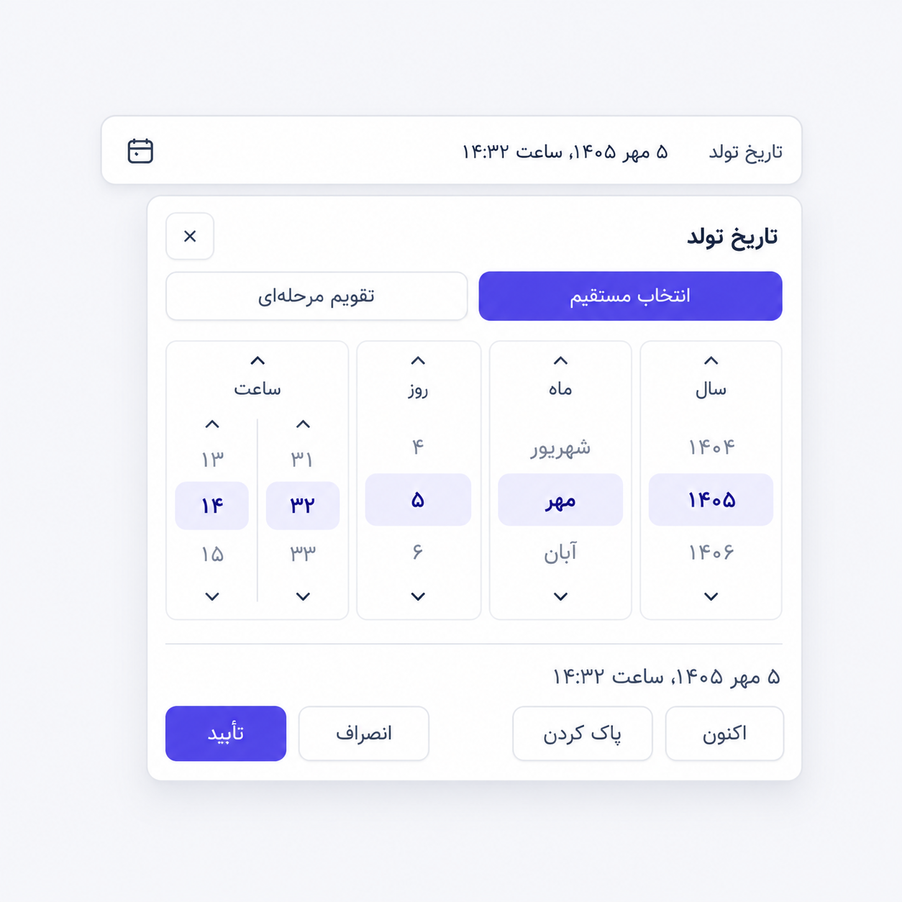
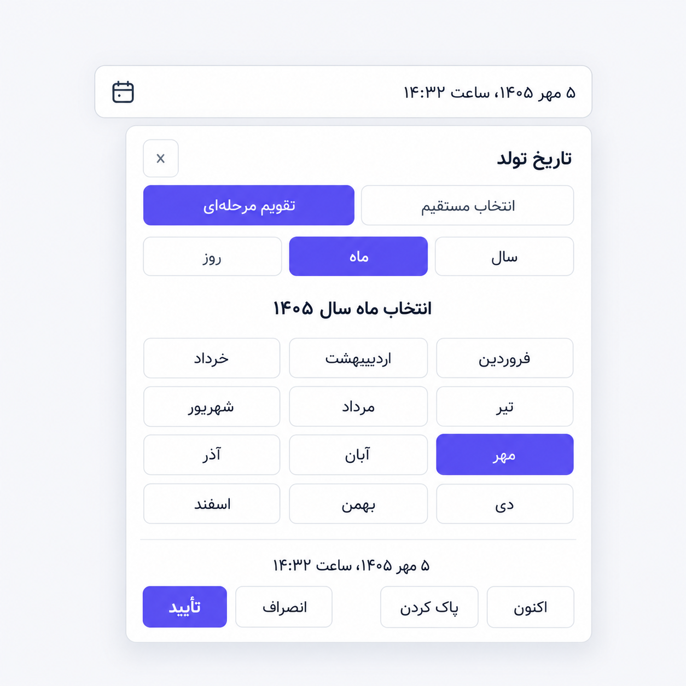
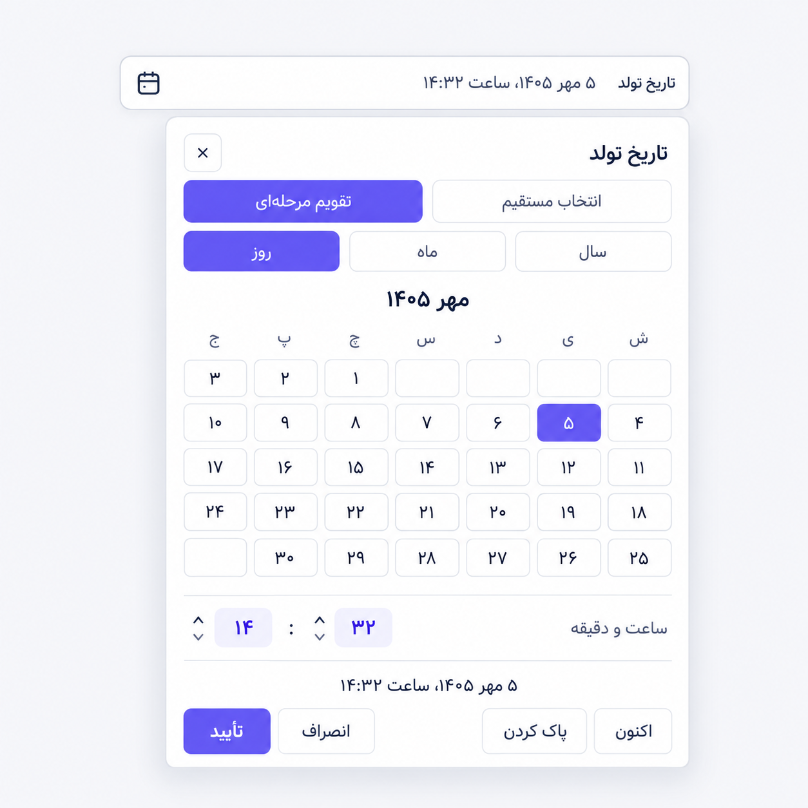
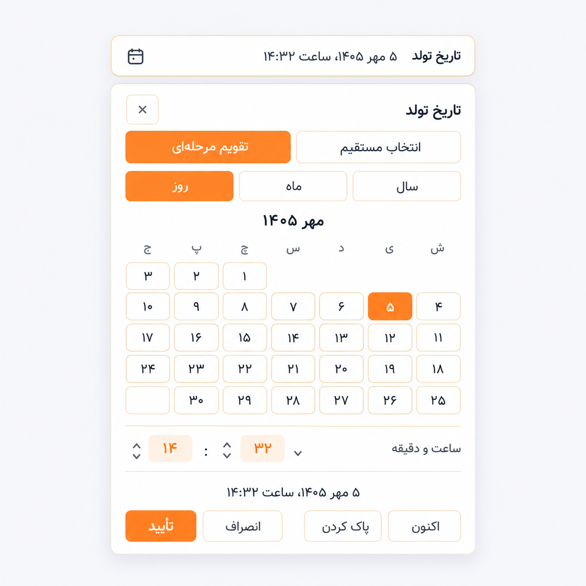

# erfan-datepicker

A Persian Jalali date and time picker for **Laravel, Blade and Alpine.js**, with **Bootstrap 5** and **Tailwind CSS** skins.

[راهنمای فارسی](README.fa.md) · [Releases](https://github.com/erfan-php/erfan-datepicker/releases) · [Report an issue](https://github.com/erfan-php/erfan-datepicker/issues) · [MIT license](LICENSE)

Choose year, month, day and time directly when you know the date, or use a guided **year → month → day** calendar. Both modes share the same selection and can be switched while editing.

## Illustrated guide

| Direct entry | Calendar — month selection |
| --- | --- |
|  |  |

| Calendar — day selection | Calendar — orange theme |
| --- | --- |
|  |  |

Generated illustrations; fonts and colors follow your app. Orange shows a custom theme.

The interface is Persian and right-to-left.

## Requirements

PHP 8.3+, Laravel 12/13, Alpine.js 3, and Bootstrap 5 or Tailwind CSS 3/4. Load Alpine and your CSS framework in the app. Composer installs `morilog/jalali` for date conversion.

## Installation

### 1. Install from GitHub

Run these commands in your Laravel app:

```sh
composer config repositories.erfan-datepicker vcs https://github.com/erfan-php/erfan-datepicker
composer require "erfan-php/erfan-datepicker:^1.0"
php artisan vendor:publish --tag=erfan-datepicker-assets
```

Laravel discovers the component automatically. If discovery is disabled, register `Erfan\Datepicker\ErfanDatepickerServiceProvider` in `bootstrap/providers.php`.

### 2. Register with your existing Alpine instance

In `resources/js/app.js`, import the published assets and register the component **before** the application's existing `Alpine.start()`:

```js
import Alpine from 'alpinejs';
import registerErfanDatepicker from './vendor/erfan-datepicker/components/erfan-datepicker.js';
import '../css/vendor/erfan-datepicker/erfan-datepicker.css';

window.Alpine = Alpine;
registerErfanDatepicker(Alpine);
Alpine.start();
```

Already using Alpine? Add the imports and registration to that setup; call `Alpine.start()` only once.

### 3. Configure the chosen skin

**Bootstrap:** load your application's Bootstrap 5 CSS as usual and use `theme="bootstrap"`. The picker does not require Bootstrap JavaScript or Vuexy.

**Tailwind 4:** explicitly include the package views in your CSS source scan. In `resources/css/app.css`:

```css
@import "tailwindcss";
@source "../../vendor/erfan-php/erfan-datepicker/resources/views";
```

**Tailwind 3:** append this path to the existing `content` array in `tailwind.config.js`:

```js
'./vendor/erfan-php/erfan-datepicker/resources/views/**/*.blade.php',
```

Build the assets and load your JS/CSS entry points through `@vite` in the layout:

```sh
npm run build
```

## Usage

### Bootstrap date and time

```blade
<x-erfan-datepicker
    name="scheduled_at"
    label="زمان برنامه‌ریزی"
    theme="bootstrap"
    :value="$scheduledAt ?? null"
    :default-now="false"
/>
```

### Tailwind birthday without time

```blade
<x-erfan-datepicker
    name="birth_date"
    label="تاریخ تولد"
    theme="tailwind"
    mode="calendar"
    :with-time="false"
    :default-now="false"
    :max="now('Asia/Tehran')->format('Y-m-d')"
    required
/>
```

Use `:` for booleans: `:with-time="false"`. Set `:default-now="false"` to leave an empty field blank.

## Submitted values

**The visible date is Jalali; the submitted value is Gregorian ASCII.**

| Mode | Submitted shape | Example |
| --- | --- | --- |
| Date and time | `YYYY-MM-DDTHH:mm` | `2026-09-27T14:32` |
| Date only | `YYYY-MM-DD` | `2026-09-27` |

Datetime strings use the configured `timezone` (default `Asia/Tehran`) and contain no UTC offset.

`value`, `min` and `max` accept strings or `DateTimeInterface`/Carbon objects. Strings may use a space instead of `T`, Persian/Arabic digits, and zero seconds. Offset-bearing ISO strings and nonzero seconds are not accepted; pass a date object for a timezone-aware timestamp. Datetime objects are converted into the configured timezone. In date-only mode their civil date is preserved without shifting timezones.

A date-only `max` includes the whole day when time is enabled. Bounds must overlap the configured Jalali year range. Invalid supplied values produce an error instead of silently selecting today.

Validate and interpret the submitted value on the server. For example, in a Laravel FormRequest:

```php
public function rules(): array
{
    return [
        'scheduled_at' => ['nullable', 'date_format:Y-m-d\TH:i'],
        'birth_date' => ['nullable', 'date_format:Y-m-d'],
    ];
}
```

Then, for a datetime you intend to store in UTC:

```php
use Carbon\CarbonImmutable;

$value = $request->validated('scheduled_at');

$scheduledAt = $value
    ? CarbonImmutable::createFromFormat('!Y-m-d\TH:i', $value, 'Asia/Tehran')->utc()
    : null;
```

Use the same timezone as the component and enforce your application's bounds and business rules on the server. Store a birthday as a civil date, without conversion to UTC.

## Component options

| Attribute | Default | Purpose |
| --- | --- | --- |
| `name` | Required | Submitted input name; bracketed names such as `dates[birth]` work. |
| `label` | `تاریخ و ساعت` | Visible field label. |
| `theme` | `tailwind` | `tailwind` or `bootstrap`. |
| `mode` | `direct` | Initial `direct` or `calendar` mode; users can switch. |
| `value` | `null` | Initial Gregorian value or date object. |
| `with-time` | `true` | Include hour and minute selection. |
| `default-now` | `true` | Initialize an empty field to now, if allowed by bounds. |
| `timezone` | `Asia/Tehran` | Timezone for now, datetime objects and submitted wall-clock times. |
| `min`, `max` | `null` | Gregorian bounds, as strings or date objects. |
| `min-year`, `max-year` | `1300`, `1450` | Inclusive Jalali year range; endpoints 1000–2999, at most 401 years. |
| `required` | `false` | Native form validation; hides the clear action. |
| `disabled` | `false` | Prevent interaction and omit the value from form submission. |
| `readonly` | `false` | Prevent editing while keeping the submitted value. |
| `clearable` | `true` | Show the clear action when the field is optional. |
| `use-old` | `true` | Let Laravel old input override `value`, including empty values. |
| `error-message` | `null` | Override Laravel's field error; `''` suppresses that instance's error. |
| `id` | Generated | Unique input ID; set explicitly when needed. |

Old input takes precedence over the default current time. Readonly and disabled fields do not generate a new current value. For optional fields or birthdays, use `:default-now="false"`.

If several forms share field names, use `:use-old="false"` on inactive forms and pass an appropriate `:error-message` to scope errors. Standard root attributes such as `class` and Alpine event listeners are forwarded to the component root.

## Alpine binding and events

```blade
<div x-data="{ scheduledAt: '' }">
    <x-erfan-datepicker
        name="scheduled_at"
        theme="tailwind"
        :default-now="false"
        x-model="scheduledAt"
        x-on:erfan-datepicker:change="console.log($event.detail)"
    />
    <output x-text="scheduledAt"></output>
</div>
```

Confirming or clearing emits `input`, `change` and `erfan-datepicker:change`. The custom event contains `name`, `value`, `timezone` and `withTime`. Edits remain a draft until confirmed; Cancel, Escape and clicking outside keep the saved value. A form reset restores the initial value.

## Customization and updates

Publish views only if you need to change the markup:

```sh
php artisan vendor:publish --tag=erfan-datepicker-views
```

View overrides live in `resources/views/vendor/erfan-datepicker`. Keep this directory in your Tailwind scan if you customize the Tailwind skin. Prefer scoped CSS overrides for small visual changes.

After updating the Composer package, republish the assets and rebuild Vite. `--force` overwrites the previously published JS/CSS, so keep application-specific changes in separate files:

```sh
composer update erfan-php/erfan-datepicker
php artisan vendor:publish --tag=erfan-datepicker-assets --force
npm run build
```

Published view overrides are your application's responsibility; compare them with the package's new templates during upgrades.

## Troubleshooting

| Symptom | Check |
| --- | --- |
| `erfanDatepicker is not defined` | Import and register on the same Alpine instance before `Alpine.start()`; rebuild assets. |
| Tailwind skin looks unstyled | Add the vendor views to source detection, load the Tailwind entry point and rebuild. |
| Bootstrap skin looks unstyled | Load Bootstrap 5 CSS and the package's published CSS. |
| Old values unexpectedly return | Laravel old input wins by default; scope multiple forms with `use-old` and `error-message`. |
| Blade component is not found | Check package discovery, then run `php artisan optimize:clear`. |

## Development

Dedicated Livewire integration and an English UI are not included.

Report bugs in [Issues](https://github.com/erfan-php/erfan-datepicker/issues) with your versions, skin and a minimal Blade example.

Clone the repository to run the tests and examples. Requires Node.js 22.12+:

```sh
composer install
npm ci
composer test
npm test
npm run build
php -S 127.0.0.1:8796 -t examples/dist
```

Open http://127.0.0.1:8796 and choose Bootstrap or Tailwind.

[Changelog](CHANGELOG.md) · [MIT license](LICENSE)
